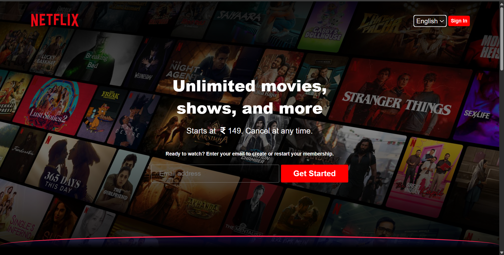
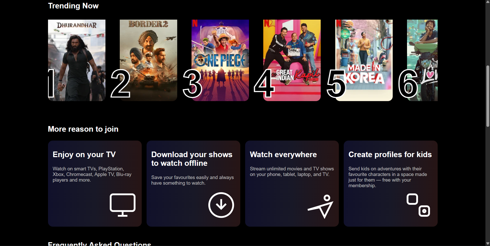
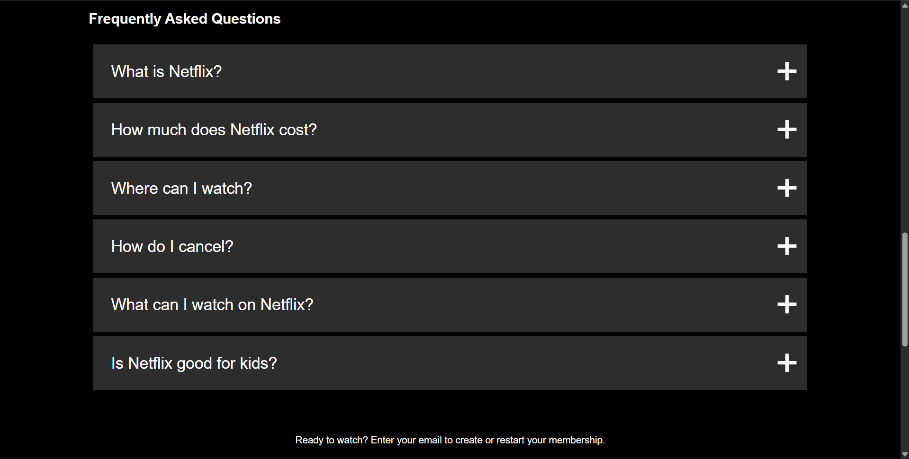
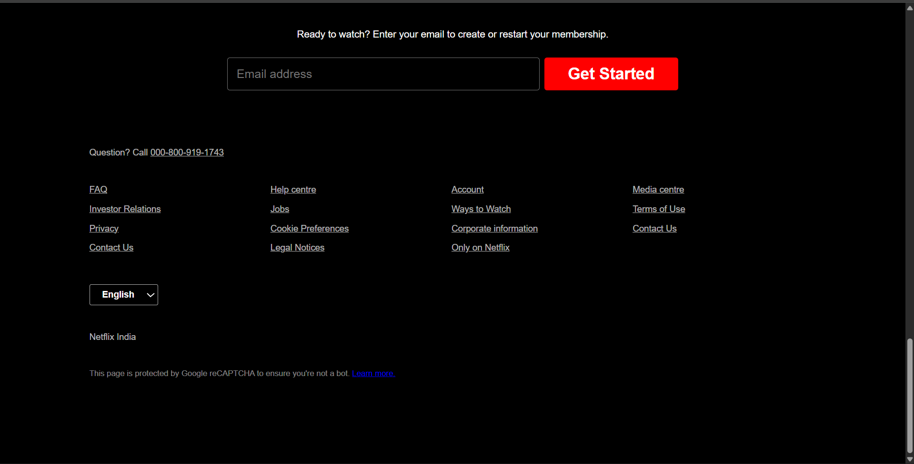

# 🎬 Netflix Clone (HTML + CSS)

A fully responsive Netflix landing page clone built using pure HTML and CSS.
This project focuses on mastering layout design, responsiveness, and UI replication.

---

## 📌 Features

* Responsive Navbar with overlay
* Hero section with background image & gradient
* Trending movies horizontal scroll section
* Numbered movie cards (Top 10 style)
* "More reasons to join" cards section
* FAQ Accordion section
* Footer section

---

## 🛠️ Tech Stack

* HTML5
* CSS3 (Flexbox + Grid)
* Font Awesome (icons)

---

## 📂 Folder Structure

```
project/
│── index.html
│── style.css
│── images/
```

---

## 📸 Screenshots

### Hero Section



### Trending Section



### FAQ Section



### Footer Section



---

## 📈 Improvements To Be Made

* Add JavaScript for FAQ animation
* Improve mobile responsiveness
* Add hover effects & animations
* Better SVG icons matching Netflix UI
* Optimize spacing & typography

---

---

## 📢 Note

This is a frontend clone created for learning purposes only.
All rights belong to Netflix.

---

## ⭐ Support

If you like this project, give it a star ⭐
